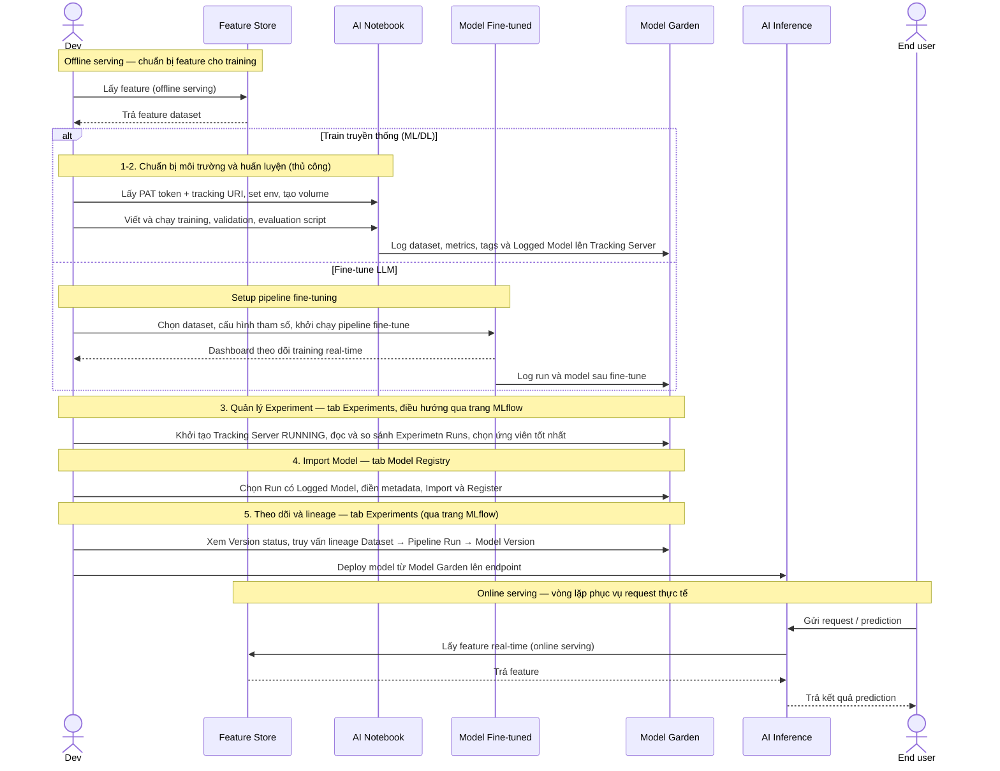
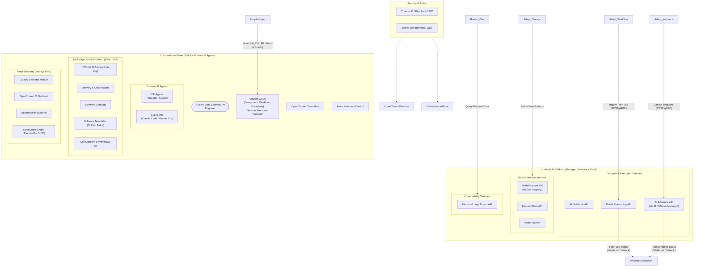

# User Flow

## MLOps Lifecycle

```mermaid
sequenceDiagram
    actor Dev
    participant FeatureStore as Feature Store
    participant Notebook as AI Notebook
    participant FineTuned as Model Fine-tuned
    participant Garden as Model Garden
    participant Inference as AI Inference
    actor EndUser as End user

    Note over Dev,FeatureStore: Offline serving — chuẩn bị feature cho training
    Dev->>FeatureStore: Lấy feature (offline serving)
    FeatureStore-->>Dev: Trả feature dataset

    alt Train truyền thống (ML/DL)
        Note over Dev,Notebook: 1-2. Chuẩn bị môi trường và huấn luyện (thủ công)
        Dev->>Notebook: Lấy PAT token + tracking URI, set env, tạo volume
        Dev->>Notebook: Viết và chạy training, validation, evaluation script
        Notebook->>Garden: Log dataset, metrics, tags và Logged Model lên Tracking Server
    else Fine-tune LLM
        Note over Dev,FineTuned: Setup pipeline fine-tuning
        Dev->>FineTuned: Chọn dataset, cấu hình tham số, khởi chạy pipeline fine-tune
        FineTuned-->>Dev: Dashboard theo dõi training real-time
        FineTuned->>Garden: Log run và model sau fine-tune
    end

    Note over Dev,Garden: 3. Quản lý Experiment — tab Experiments, điều hướng qua trang MLflow
    Dev->>Garden: Khởi tạo Tracking Server RUNNING, đọc và so sánh Experimetn Runs, chọn ứng viên tốt nhất

    Note over Dev,Garden: 4. Import Model — tab Model Registry
    Dev->>Garden: Chọn Run có Logged Model, điền metadata, Import và Register

    Note over Dev,Garden: 5. Theo dõi và lineage — tab Experiments (qua trang MLflow)
    Dev->>Garden: Xem Version status, truy vấn lineage Dataset → Pipeline Run → Model Version

    Dev->>Inference: Deploy model từ Model Garden lên endpoint

    Note over EndUser,FeatureStore: Online serving — vòng lặp phục vụ request thực tế
    EndUser->>Inference: Gửi request / prediction
    Inference->>FeatureStore: Lấy feature real-time (online serving)
    FeatureStore-->>Inference: Trả feature
    Inference-->>EndUser: Trả kết quả prediction
```

## Platform Architecture

```mermaid
flowchart TB
    %% 1. Experience Plane / Developer Portal
    subgraph ExperiencePlane ["1. Experience Plane (Built for Humans & Agents)"]
        direction TB

        User(["👤 User / Data Scientist / AI Engineer"])

        subgraph ExternalAgents ["External AI Agents"]
            direction LR
            IDE["IDE Agents\n(VSCode / Cursor)"]
            CLI["CLI Agents\n(Claude Code / Gemini CLI)"]
        end

        subgraph PortalUI ["Backstage Portal Frontend (React SPA)"]
            AssistantUI["💬 Portal AI Assistant (In-App)"]
            Dashboards["Delivery & Cost Insights"]
            CatalogUI["Software Catalogs"]
            TemplatesUI["Software Templates (Golden Paths)"]
            DiagramUI["Cell Diagram & Workflows UI"]
        end

        subgraph PortalBFF ["Portal Backend (Node.js BFF)"]
            BFF_Catalog["Catalog Backend Module"]
            BFF_CI["OpenChoreo CI Backend"]
            BFF_Obs["Observability Backend"]
            BFF_Auth["OpenChoreo Auth (ThunderID / OIDC)"]
        end

        direction LR
        K8s_CRDs["Custom CRDs\n(Component, Workload, Dataplane)\n*Acts as Metadata Trackers*"]
        OC_Controllers["OpenChoreo Controllers"]
        RBAC_Gate["Authz & Access Control"]
    end

    AdapterLayer -->|"Write Job_ID / URL Status\n(K8s API)"| K8s_CRDs

    %% 4. Resource Substrate (Viettel AI Platform - Managed Services)
    subgraph ViettelSubstrate ["4. Viettel AI Platform (Managed Services & PaaS)"]
        direction TB

        subgraph ComputeServices ["Compute & Execution Services"]
            direction LR
            VT_Notebook["AI Notebook API"]
            VT_Finetune["Model Fine-tuning API"]
            VT_Inference["AI Inference API\n(vLLM / KServe Managed)"]
        end

        subgraph DataServices ["Data & Storage Services"]
            direction LR
            VT_Garden["Model Garden API\n(MLflow Registry)"]
            VT_Feature["Feature Store API"]
            VT_Vector["Vector DB API"]
        end

        subgraph ObsServices ["Observability Services"]
            VT_Metrics["Metrics & Logs Export API"]
        end
    end

    %% API interactions
    Adapt_Workflow --->|"Trigger Train Job (REST/gRPC)"| VT_Finetune
    Adapt_Inference --->|"Create Endpoint (REST/gRPC)"| VT_Inference
    Adapt_Storage --->|"Fetch/Save Artifacts"| DataServices
    Router_Obs --->|"Query Runtime Data"| ObsServices

    %% Webhook callbacks
    VT_Finetune -.->|"Push Job Status\n(Webhook Callback)"| Webhook_Receiver
    VT_Inference -.->|"Push Endpoint Status\n(Webhook Callback)"| Webhook_Receiver

    %% 5. Cross-cutting Concerns
    subgraph SecurityCol ["Security & Policy"]
        Auth_Sec["ThunderID / Keycloak OIDC"]
        Vault_Sec["Secret Management / Vault"]
    end

    SecurityCol -.-> OpenChoreoPlatform
    SecurityCol -.-> OrchestrationPlane
```